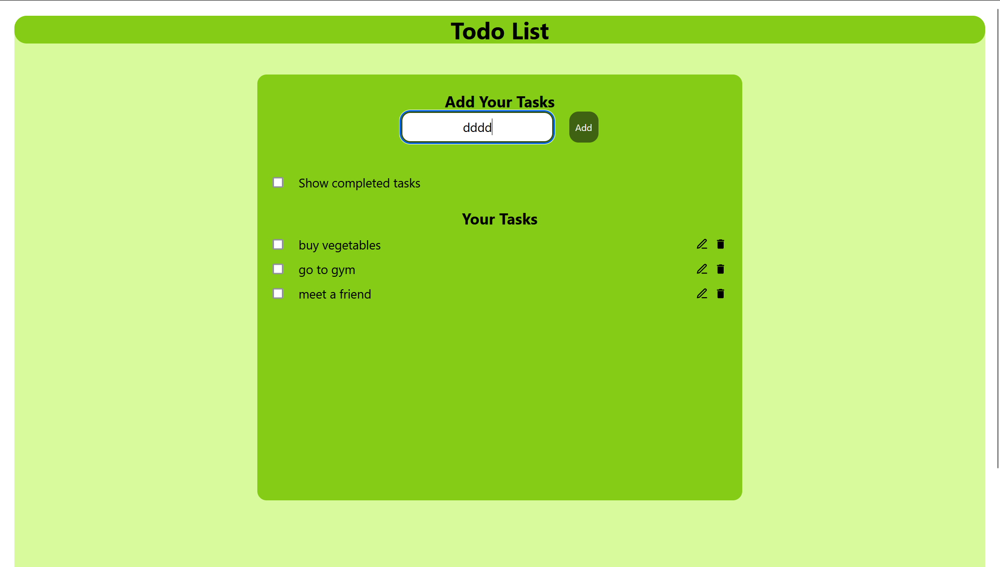
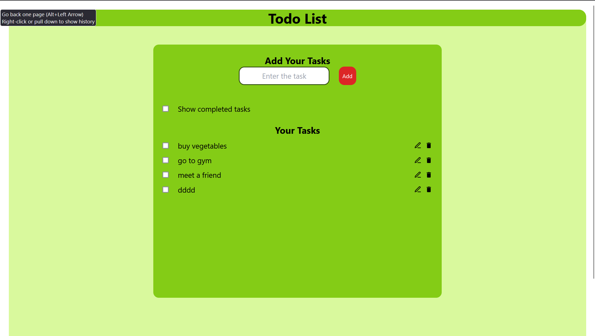
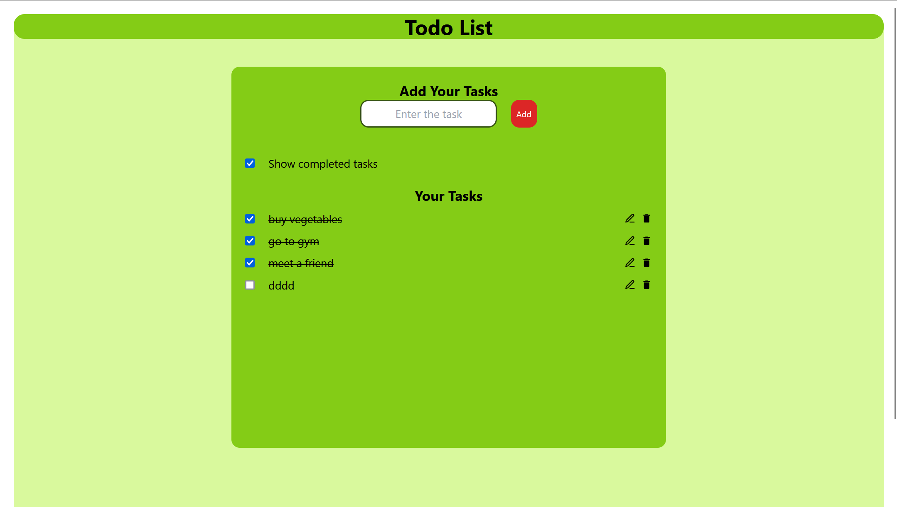
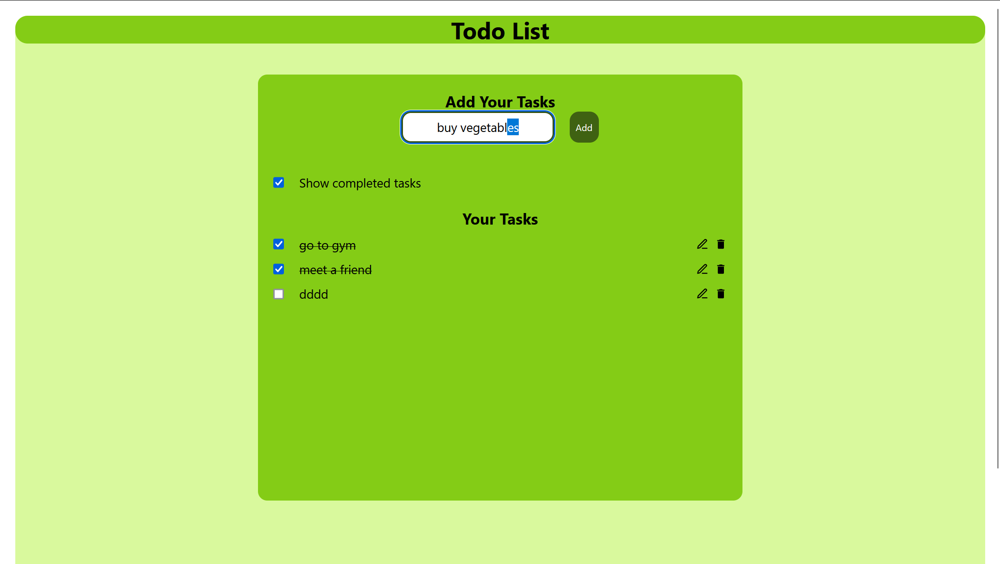
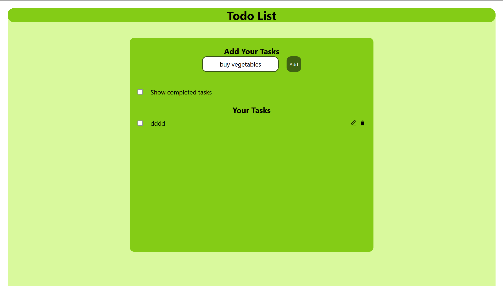
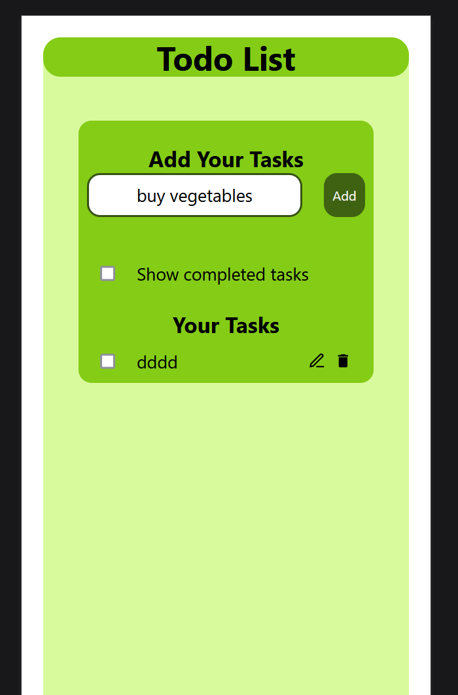
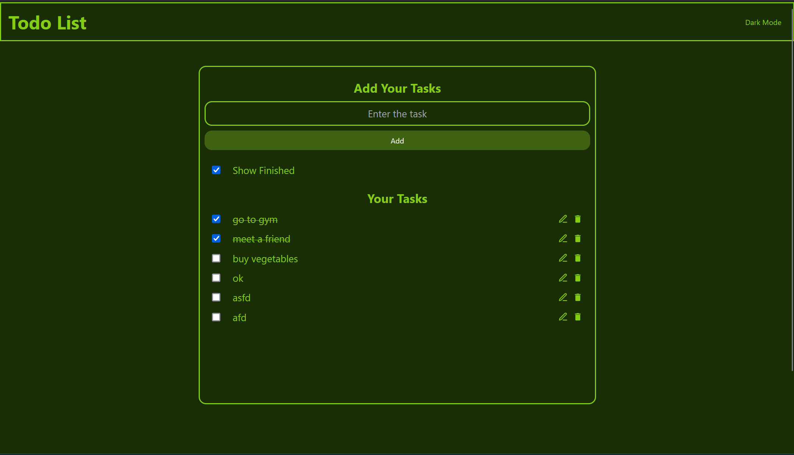
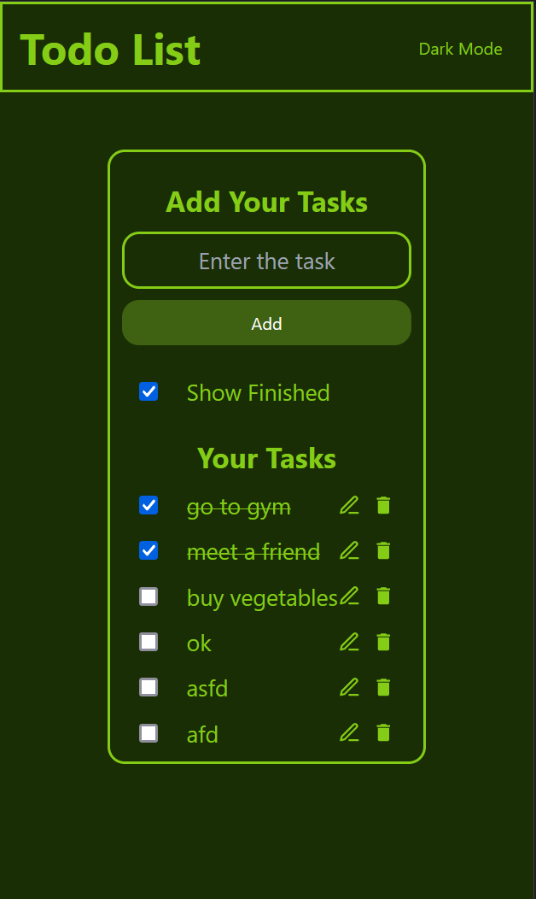

# React Todo App

Welcome to the React Todo App repository! This project is a simple yet effective todo list application built using React. It offers a range of features to help you manage your tasks efficiently.

## Features

- **Responsive Design**: The app is designed to work seamlessly across various devices and screen sizes, ensuring a smooth user experience on desktops, tablets, and smartphones.

- **Persistent Storage**: Tasks are stored locally, so you won't lose your progress even if you reload the page or close the browser.

- **Task Management**:
  - **Add Tasks**: Easily add new tasks to your todo list.
  - **Edit Tasks**: Modify existing tasks to update their details.
  - **Delete Tasks**: Remove tasks that are no longer needed.
  - **Mark as Complete**: Keep track of your progress by marking tasks as complete.
  - **View Completed Tasks**: Access a list of completed tasks for reference.

- **Dark Mode**: Added a dark mode feature for better user experience in low-light environments.

## Getting Started

To run the app locally, follow these steps:

1. Clone this repository to your local machine:

    ```bash
    git clone https://github.com/your-username/react-todo-app.git
    ```

2. Navigate to the project directory:

    ```bash
    cd react-todo-app
    ```

3. Install dependencies using npm or yarn:

    ```bash
    npm install
    # or
    yarn install
    ```

4. Start the development server:

    ```bash
    npm run dev
    # or
    yarn run dev
    ```

5. Open your browser and visit `http://localhost:3000` to view the app.

## Screenshots

















## Technologies Used

- **React**: A JavaScript library for building user interfaces.
- **Local Storage**: Utilized for persistent storage of tasks.
- **CSS**: Custom styling for a responsive and visually appealing design.

## Contributing

Contributions are welcome! If you have suggestions for improving this project, feel free to open an issue or submit a pull request.

thank you - ashwin

